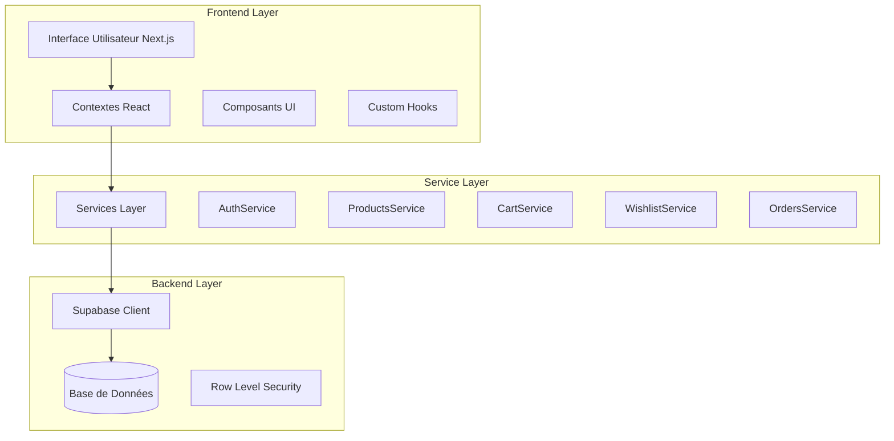
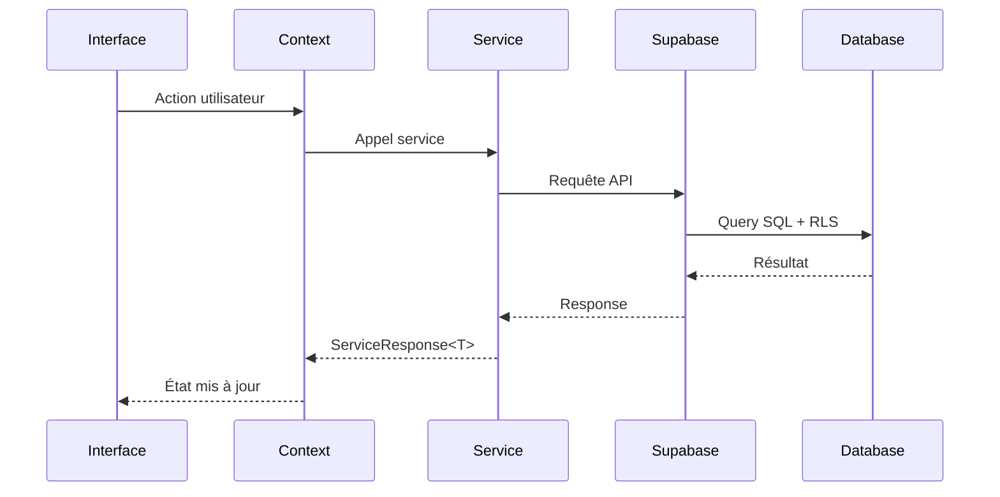
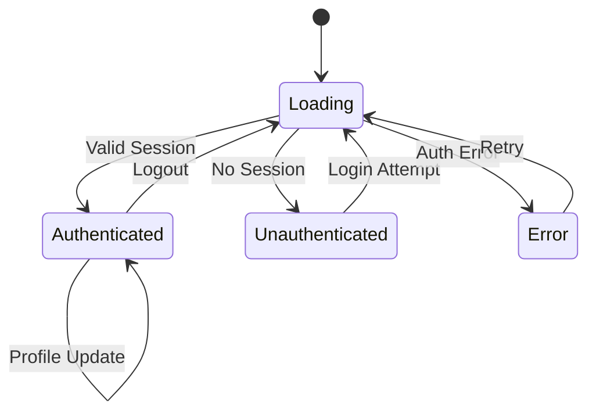
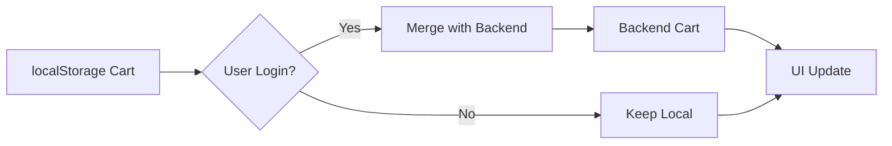

# Design Document

## Overview

Cette conception détaille l'intégration de l'interface utilisateur Next.js existante avec les services backend Supabase. L'objectif est de remplacer progressivement les données mockées par des données réelles tout en maintenant une expérience utilisateur fluide et performante.

L'architecture existante comprend déjà :
- 19 services backend complets avec BaseService
- Contextes React pour l'authentification et le panier
- Types TypeScript définis
- Configuration Supabase avec RLS
- Composants UI avec shadcn/ui

## Architecture

### Architecture Globale



### Flux de Données



## Components and Interfaces

### 1. Services Integration Pattern

Tous les services suivent le pattern BaseService existant :

```typescript
interface ServiceResponse<T> {
  data: T | null;
  error: string | null;
  success: boolean;
}

interface PaginatedResponse<T> extends ServiceResponse<T[]> {
  pagination: {
    page: number;
    limit: number;
    total: number;
    totalPages: number;
    hasNext: boolean;
    hasPrev: boolean;
  };
}
```

### 2. Context Enhancement Pattern

Les contextes existants seront étendus pour gérer :
- États de chargement granulaires
- Gestion d'erreurs avec retry
- Synchronisation localStorage/backend
- Optimistic updates

```typescript
interface EnhancedContextState<T> {
  data: T | null;
  loading: boolean;
  error: string | null;
  lastFetch: Date | null;
  retry: () => Promise<void>;
  refresh: () => Promise<void>;
}
```

### 3. Component Data Loading Pattern

```typescript
interface ComponentDataState<T> {
  data: T[];
  loading: boolean;
  error: string | null;
  isEmpty: boolean;
  hasMore: boolean;
  loadMore: () => Promise<void>;
  retry: () => Promise<void>;
}
```

### 4. Authentication Flow



### 5. Product Catalog Integration

#### ProductGrid Component Enhancement
- Remplacer les props mockées par des appels ProductsService
- Implémenter pagination avec infinite scroll
- Ajouter filtres dynamiques via CategoriesService
- Gérer les états de chargement avec skeletons

#### TrendingProducts Component
- Utiliser ProductsService.getPopular()
- Implémenter cache avec SWR pattern
- Ajouter fallback pour données indisponibles

### 6. Cart Synchronization Strategy



#### Stratégie de Synchronisation
1. **Utilisateur non connecté** : Utiliser localStorage
2. **Connexion** : Fusionner panier local avec backend
3. **Utilisateur connecté** : Toutes les opérations via CartService
4. **Déconnexion** : Sauvegarder en local

### 7. Error Handling Strategy

#### Niveaux d'Erreurs
1. **Network Errors** : Retry automatique avec backoff
2. **Authentication Errors** : Redirection vers login
3. **Permission Errors** : Message utilisateur approprié
4. **Validation Errors** : Feedback inline
5. **Server Errors** : Fallback graceful

#### Error Boundary Pattern
```typescript
interface ErrorBoundaryState {
  hasError: boolean;
  error: Error | null;
  errorInfo: ErrorInfo | null;
  retryCount: number;
}
```

### 8. Loading States Management

#### Types d'États de Chargement
1. **Initial Loading** : Première charge de données
2. **Refresh Loading** : Actualisation des données
3. **Action Loading** : Actions utilisateur (ajout panier, etc.)
4. **Background Loading** : Chargement en arrière-plan
5. **Pagination Loading** : Chargement de pages supplémentaires

#### Skeleton Components
- ProductSkeleton : Grilles de produits
- HeaderSkeleton : En-têtes de sections
- ProfileSkeleton : Informations utilisateur
- CartSkeleton : Éléments du panier

## Data Models

### 1. Enhanced Product Model
```typescript
interface EnhancedProduct extends Product {
  // Données calculées
  discountPercentage?: number;
  isInStock: boolean;
  isWishlisted?: boolean;
  isInCart?: boolean;
  
  // Relations enrichies
  category?: CategoryReference;
  vendor?: VendorReference;
  reviews?: ProductReview[];
  
  // Métadonnées UI
  loading?: boolean;
  optimisticUpdate?: boolean;
}
```

### 2. User Session Model
```typescript
interface UserSession {
  user: User | null;
  profile: UserProfile | null;
  session: Session | null;
  permissions: string[];
  preferences: UserPreferences;
  stats: UserStats;
}
```

### 3. Cart State Model
```typescript
interface CartState {
  items: CartItem[];
  summary: CartSummary | null;
  loading: boolean;
  syncing: boolean;
  lastSync: Date | null;
  localChanges: boolean;
}
```

## Error Handling

### 1. Service Layer Error Handling
- Utilisation du pattern ServiceResponse existant
- Mapping des erreurs Supabase vers messages utilisateur
- Logging des erreurs pour monitoring

### 2. Context Layer Error Handling
```typescript
interface ContextErrorState {
  error: string | null;
  errorType: 'network' | 'auth' | 'validation' | 'server';
  retryable: boolean;
  retryCount: number;
  lastRetry: Date | null;
}
```

### 3. Component Error Handling
- ErrorBoundary pour erreurs React
- ErrorState component pour erreurs de données
- Toast notifications pour erreurs d'actions

### 4. Network Error Recovery
```typescript
interface RetryConfig {
  maxRetries: number;
  backoffMultiplier: number;
  initialDelay: number;
  maxDelay: number;
}
```

## Testing Strategy

### 1. Service Layer Testing
- Tests unitaires pour chaque service
- Mocking de Supabase client
- Tests d'intégration avec base de test

### 2. Context Testing
- Tests des états et transitions
- Mocking des services
- Tests de synchronisation

### 3. Component Testing
- Tests de rendu avec données mockées
- Tests d'interactions utilisateur
- Tests d'états de chargement et d'erreur

### 4. E2E Testing
- Parcours utilisateur complets
- Tests d'authentification
- Tests de panier et commandes

## Performance Considerations

### 1. Data Fetching Optimization
- Utilisation de React Query/SWR pour cache
- Pagination et lazy loading
- Prefetching des données critiques

### 2. Image Optimization
- Next.js Image component
- Lazy loading des images produits
- Formats optimisés (WebP, AVIF)

### 3. Bundle Optimization
- Code splitting par route
- Dynamic imports pour composants lourds
- Tree shaking des services non utilisés

### 4. Caching Strategy
```typescript
interface CacheConfig {
  staleTime: number;
  cacheTime: number;
  refetchOnWindowFocus: boolean;
  refetchOnReconnect: boolean;
}
```

## Security Implementation

### 1. RLS Policy Enforcement
- Vérification des permissions côté client
- Gestion des erreurs d'autorisation
- Fallback pour données non autorisées

### 2. Input Validation
- Validation côté client et serveur
- Sanitization des données utilisateur
- Protection contre XSS et injection

### 3. Session Management
- Refresh automatique des tokens
- Déconnexion sur expiration
- Nettoyage des données sensibles

### 4. API Security
- Rate limiting côté client
- Retry avec backoff exponentiel
- Protection contre les attaques CSRF

## Migration Strategy

### 1. Phase 1 : Authentication
- Connecter les pages auth existantes
- Implémenter la gestion de session
- Tester les flux d'authentification

### 2. Phase 2 : Product Catalog
- Remplacer les données mockées des produits
- Implémenter la recherche et filtres
- Ajouter pagination et états de chargement

### 3. Phase 3 : Cart & Wishlist
- Connecter le panier au backend
- Implémenter la synchronisation
- Ajouter la gestion de la wishlist

### 4. Phase 4 : User Account
- Connecter les pages de compte
- Implémenter l'historique des commandes
- Ajouter la gestion du profil

### 5. Phase 5 : Optimization
- Implémenter le caching avancé
- Optimiser les performances
- Ajouter les tests E2E